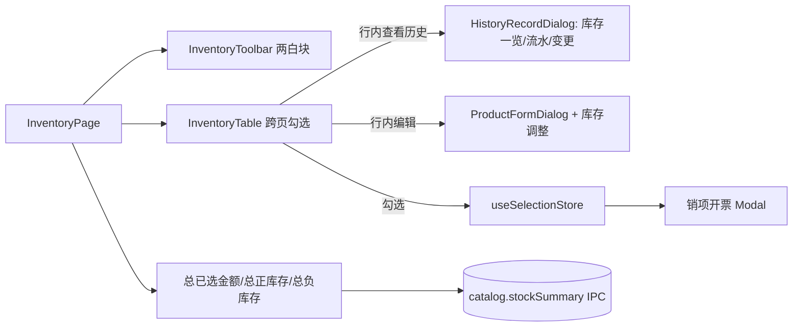

## 用户需求概述

对 cdlaser-invoice-tool 桌面端渲染层做一次集中的 UI 重组与 Bug 修复，落实业务 PRD 的交互意图，并修复历史记录无法重复打开与库存流水校验失败的问题。

## 核心功能

- **布局调整**：侧边栏改为浅色主题；移除顶部 Header；每个一级页面（客户管理 / 库存与开票 / 开票记录）增加页面标题。
- **工具栏重组**：InventoryPage 工具栏改为"商品管理""库存与开票"两个白块并排，移除"记录与工具"分组；初始化导入并入"商品管理"白块（仅首次未完成时显示）。
- **历史记录合并**：行内"查看历史"抽屉合并展示「库存一览（价格版本+当前库存）」「库存流水（ledger）」「变更历史（fieldHistory）」；收窄主表"项目名称"列宽。
- **库存调整并入编辑**：商品编辑弹窗内嵌入库存调整区（当前库存 + 调整量 + 原因），复用现有调整服务。
- **修复 Bug**：修复"历史记录只能打开一次"的 ModalHost 状态错误；修复 `inventory.ledger`（空 priceVersionId）与 `catalog.listPriceVersions`（pageSize=200 超出 [20,50,100]）参数校验失败。
- **销项开票 Modal 完善**：按 PRD §7.5 重写——选择客户、从已选/搜索勾选价格版本、填写正整数数量、计算金额/税额/价税合计、生成税务模板 Excel。
- **月底导出**：确认默认即为当前所有 库存<0 的实时快照（数量取绝对值），无日期筛选。
- **汇总统计**：新增总已选金额（由勾选 store 计算）、总正库存、总负库存（后端聚合），展示在库存页面工具栏/页脚。

## 技术栈

- 渲染进程：React 19 + TypeScript + Ant Design v6 + Tailwind CSS v4（已有）；状态 zustand（selection/app store）。
- 主进程：Electron + better-sqlite3 + Drizzle ORM；IPC 经 `registerHandler` + Zod schema 校验。
- 复用既有约定：antd 组件覆盖 Tailwind 样式必须加 `!`；金额计算用 `src/shared/money`；跨页勾选走 `useSelectionStore`。

## 实现策略

### 1. 布局与主题（浅色侧边栏 / 去 Header / 页面标题）

- `AppShell.tsx`：`<Sider theme="dark">` 改为浅色（去掉 `theme` 或 `theme="light"`，底色改白/浅灰），删除 `<Header>` 节点；`<Content>` 顶部留出页面标题区。
- `AppSidebar.tsx`：导航文字由 `text-white/*` 改为深色（`text-gray-700`/选中 `text-brand`），品牌标题改深色。
- 删除 `AppHeader.tsx` 引用；设置入口仍由右下角 `CosBackupPanel` 浮动按钮提供（PRD §8，不占路由）。
- 三个 Page 组件各自渲染页面标题（如 `<div className="!text-lg !font-semibold">库存与开票</div>`）。

### 2. 修复"历史记录只能打开一次"+ 校验失败（根因）

- **ModalHost Bug**：`InventoryModalHost` 中 `historyOpen`/`priceOpen` 为本地 state，关闭时只 `setHistoryOpen(false)` 而未 `onChange(null)`，导致 `type` 残留 `'history'`，再次打开不触发 `useEffect`。改为直接由 `type` 派生 `open={type==='history'}`（删除本地 state），`onClose` 统一调用 `onChange(null)`。
- **ledger 校验失败**：`InventoryPage.loadStock` 调 `api.inventory.ledger(sSearch||'', ...)` 把搜索串当 `priceVersionId` 传入空串触发 `ledgerQuerySchema` 失败。因库存流水改为"按商品"在抽屉内查询，移除 stock/ledger Tab，改由历史抽屉按 `productId` 查 ledger。
- **listPriceVersions 校验失败**：`PriceVersionList` 传 `pageSize:200` 被 `pageRequestSchema` 的 `[20,50,100]` refine 拒绝。改为 `pageSize:100`（仍在允许集合内）。
- **schema 调整**：`ledgerQuerySchema` 改为 `priceVersionId?` + `productId?`（至少其一，用 `.refine` 保证）；`priceVersionQuerySchema` 增加 `productId?` 字段（让按商品过滤生效，不再被 strip）。

### 3. 库存页面重组（两个白块 + 移除记录与工具）

- `InventoryToolbar` 重写为两个 `bg-white border border-line rounded-lg` 白块并排：
- 商品管理：新增商品、商品导入、（首次未完成时）初始化导入。
- 库存与开票：销项开票、月底导出、月初进项。
- 移除"记录与工具"分组；"查看历史"改为表格行内操作。
- `InventoryPage` 移除 `stock`/`ledger` Tab（保留商品 Tab），移除 `loadStock`/`StockTable`/`StockToolbar` 死代码；保留跨页勾选逻辑。

### 4. 历史记录抽屉合并

- `HistoryRecordDialog` 改为 Drawer 内 `Tabs`：库存一览（复用 `PriceVersionList` 内容）、库存流水（调 `api.inventory.ledger(productId,...)`）、变更历史（现 fieldHistory）。接收 `product` 上下文。

### 5. 库存调整并入编辑

- `ProductFormDialog` 编辑态下新增"库存调整"区：列出该商品价格版本及当前库存，复用 `InventoryAdjustDialog` 的表单/服务（`api.inventory.adjust`）做行内调整；保留二次确认。

### 6. 销项开票 Modal（PRD §7.5）

- 重写 `OutboundExportDialog`：客户选择（启用客户）、价格版本清单（带入 `useSelectionStore` 已选项 + 可搜索补选）、每行正整数数量、实时计算 金额=数量×单价（四舍五入2位）、税额=金额×0.13、价税合计；调用 `api.outbound.export({customerId, lines, amountFactor})`（匹配 `outboundExportSchema`）；成功后保存记录并逐行减库存。需 [subagent:code-explorer] 核对 `outbound-export.ts`/`tax-template-writer.ts` 与 preload 签名。

### 7. 汇总统计

- 后端新增 `catalog.stockSummary` IPC：SQL 按 `stockBalance` 符号聚合返回 `{positiveStock, negativeStock, totalStock}`（一次扫描，O(n) 可忽略）。
- 前端：总正/负库存取自该接口；总已选金额由 `useSelectionStore.quantities` × `meta.unitPriceDecimal` 客户端计算；在库存页面工具栏/页脚展示。

## 实现注意

- 仅改渲染层与必要 IPC/schema，不影响出库记录、客户管理既有逻辑（仅加标题）。
- antd 覆盖样式一律加 `!`；删除死代码避免 lint 报错。
- 汇总聚合与 ledger 查询走已有 better-sqlite3 索引，避免在渲染进程做全表遍历。
- 保留 `destroyOnClose` 等既有 Modal 行为，未保存表单关闭二次确认不变。

## 架构设计

库存页面数据流（重组后）：



## 目录结构

```
src/renderer/layouts/AppShell/
  AppShell.tsx            [MODIFY] Sider 改浅色、删除 Header、预留标题区
  AppSidebar.tsx          [MODIFY] 导航文字改深色、选中态用 brand
  AppHeader.tsx           [DELETE] 移除头部（设置改由 CosBackupPanel 提供）
src/renderer/pages/inventory/
  InventoryPage.tsx       [MODIFY] 移除 stock/ledger Tab 与 loadStock；加页面标题、汇总统计
  components/
    InventoryToolbar.tsx  [MODIFY] 两个白块、移除记录与工具、初始化导入并入商品管理
    InventoryTable.tsx    [MODIFY] 收窄项目名称列、增加行内"查看历史"、保留跨页勾选
    InventoryTabs.tsx     [DELETE] 不再需要 Tab
    StockToolbar.tsx      [DELETE] 死代码
    StockTable.tsx        [DELETE] 死代码
  modals/
    InventoryModalHost.tsx [MODIFY] 修复 open 派生逻辑，onClose 统一 onChange(null)
    HistoryRecordDialog.tsx [MODIFY] Tabs 合并 库存一览/流水/变更历史
    PriceVersionList.tsx  [MODIFY] pageSize 改 100，复用于历史抽屉
    InventoryAdjustDialog.tsx [MODIFY] 抽离为可嵌入 ProductForm 的调整子表单
    ProductFormDialog.tsx [MODIFY] 编辑态嵌入库存调整区
    OutboundExportDialog.tsx [MODIFY] 按 PRD §7.5 重写销项开票
    ReplenishmentExportDialog.tsx [MODIFY] 确认默认全量负库存无日期筛选
src/renderer/pages/customers/CustomersPage.tsx       [MODIFY] 加页面标题
src/renderer/pages/outbound-records/OutboundRecordsPage.tsx [MODIFY] 加页面标题
src/shared/schemas/index.ts  [MODIFY] ledgerQuerySchema 支持 productId/priceVersionId；priceVersionQuerySchema 增加 productId
src/main/ipc/inventory-ipc.ts [MODIFY] ledger handler 支持 productId
src/main/domains/inventory/ledger-service.ts [MODIFY] queryLedger 增加 productId 过滤
src/main/ipc/catalog-ipc.ts  [MODIFY] 新增 catalog.stockSummary handler
src/main/domains/catalog/catalog-query.ts [MODIFY] 新增 stockSummary 聚合查询
```

## 关键代码结构

```ts
// src/shared/schemas/index.ts
export const ledgerQuerySchema = z
  .object({
    priceVersionId: z.string().min(1).optional(),
    productId: z.string().min(1).optional(),
    ...pageRequestSchema.shape,
  })
  .refine((d) => d.priceVersionId || d.productId, 'priceVersionId 或 productId 必填');

export interface StockSummary {
  positiveStock: number;
  negativeStock: number;
  totalStock: number;
}
```

## 设计风格

采用浅色专业 B 端风格：浅灰内容背景 + 白色卡片（白块）承载业务操作与表格；侧边栏由深色改为浅色，导航文字深色、选中项用品牌蓝高亮。移除顶部 Header 后，每个页面顶部以清晰的页面标题建立层级。整体保持克制留白、统一圆角与边框线，交互沿用 antd 组件，勾选/展开等微交互保持流畅。

## 页面区块（以"库存与开票"为例）

- 顶部：页面标题「库存与开票」+ 汇总条（总已选金额 / 总正库存 / 总负库存）。
- 工具栏区：两个并排白色卡片——「商品管理」（新增商品、商品导入、初始化导入）与「库存与开票」（销项开票、月底导出、月初进项）。
- 主表格：白色卡片内商品价格版本大表，固定表头与右侧操作列，行内含查看历史/编辑/库存调整；多选框跨页保留。
- 抽屉/弹窗：历史记录抽屉（库存一览/流水/变更历史三段）、销项开票大 Modal、商品编辑（含库存调整）。

## Agent Extensions

### SubAgent

- **code-explorer**
- Purpose: 核对销项开票导出链路（`outbound-export.ts`、`tax-template/template-writer.ts`、preload `api.outbound.export` 签名与 `outboundExportSchema`）及 selection store 结构，确保 Modal 重写与现有后端一致。
- Expected outcome: 确认后端支持 customerId+lines 导出、税务模板写入字段，并产出准确的接入点清单。

### Skill

- **ant-design**
- Purpose: 指导浅色侧边栏、白块工具栏、Drawer/Modal 与大表格的 antd v6 组件与主题 token 用法。
- Expected outcome: 组件选型与样式覆盖（`!` 修饰符）符合项目既有 antd+Tailwind 约定，避免样式冲突。